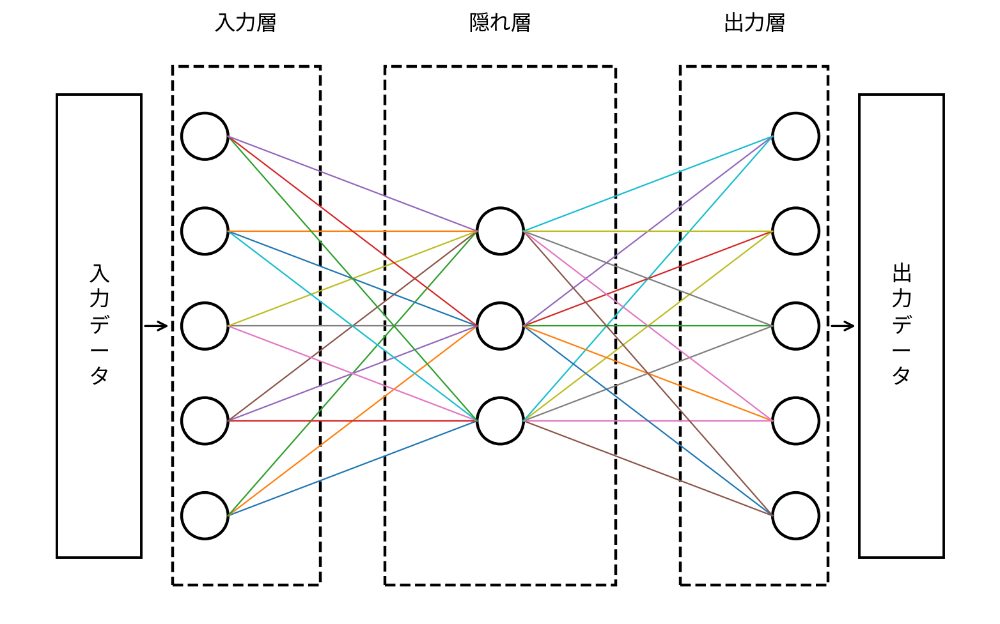

## ニューラルネットワークとは？
- **人間の脳の神経回路（ニューロン）を模した仕組み**を数式で表したモデル    
- データを入力し、いくつもの「層」を通して処理し、最終的に出力を得る

--- 
## 学習の過程
1. 入力層がデータの数だけノードを作成し、入力ベクトルを受け取る。
2. 入力ベクトルは重み付き結合で重みを掛けられ、バイアスを足されることで重み付き和になる。
3. 重み付き和は隠れ層のノードで **活性化関数** によって変換され、再び重み付き結合を通して次の層に渡される。
4. 出力層で出力の数だけノードを作成し、重み付き和を出力形式に合わせて活性化関数で変換することで予測値を得る。
5. 予測値と正解値を **損失関数** に渡し、<mark>正解値と現在の予測値の誤差（**損失**）</mark>を求める。
6. 損失が最小になるように重みとバイアスを更新する。
7. 上記の一連の流れが1回の学習であり、これを繰り返すことでモデルの精度を上げる。
