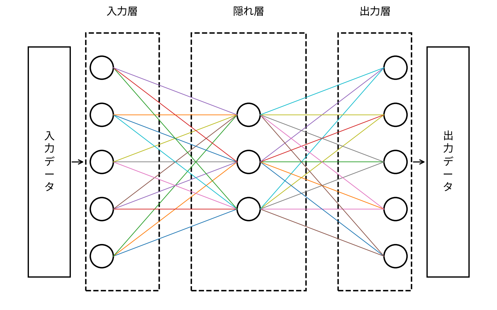

ここでは、最初に覚えておくと理解しやすい単語を並べます。

- **ノード,ユニット,ニューロン**
	- すべて同じ意味、入力された値を計算して出力する丸。

- **層（layer）**
	- ノードが複数まとまっているやつ、だいたい四角の枠で表される。層は横に連ねることが可能。

- **入力ベクトル**
	- 外部から与えられる入力データ、基本的に$\vec{X}=(x_{1},x_{2},...,x_{n})$という形で表される。

- **入力層**
	- 一番最初の層、入力データを与えられる。

- **入力ノード（入力層のノード）**
	- 入力層に属するノード、このノードは計算をせず、入力ベクトルを次の層に渡す役割しかない。

- **結合（シナプス）**
	- ノード間に存在する線。

- **重み（weight）**
	- ノード間に存在する値、入力ベクトルに掛ける。
	- $w_{ij}$で表されることが多い。iは値を入力するノード、jは受け取るノードのインデックス。
	- 重みは任意の実数値を取る（負の値もある）。
- **重み付き結合**
	- 重みのついた結合、すべての結合には重みがついているので結合とほとんど同じ意味。
- **バイアス（bias）**
	- それぞれのノードに存在する値、重み付き結合を通った（重みを掛けた）入力ベクトルに足す。
	- $b_{j}$で表されることが多い。jは重みを掛けた入力ベクトルを受け取るノードのインデックス。
- **重み付き和（線形結合）**
	- 一つのノードに伸びた重み付き結合$w_{ij}x_{i}$すべてにバイアスを足し、それらすべてを足し合わせたもの。
$$
z_{j}=\sum_{i}w_{ij}x_{i}+b_{j}
$$
で表されることが多い。
- **活性化関数（activation function）**
	- 同じ入力でも出力が変化する関数、重み付き和を入力として受け取る。
		- より詳しくすると非線形に変換してノードの出力を決める関数。
	- メジャーなものに、Sigmoid, tanh, ReLU, Softmax などがある。
- **隠れ層**
	- 入力層の次から出力層までのすべての層、バイアスを持ち、入力ベクトルを活性化関数で変換する。
	- ネットワークの「深さ」と呼ばれるものは、隠れ層の数で決まる。
- **出力層**
	- 一番最後の層、隠れ層の最後の層から入力を受け取り、最初に規定した出力形式に値を変換する。
	- 例えば2値分類なら1つ、多クラス分類ならクラスの数だけ出力ノードがある。
	- なぜかここだけ出力ユニットと言われがちなので注意。
- **予測値（prediction / output）**
	- 出力層の出力値、分類では確率になり、回帰では数値になる。
- **正解値（label / target）**
	- 学習の最初に与える「答えデータ」、予測値との比較に用いる。
- **損失関数（loss function）**
	- 予測値と正解値の差を数値化する関数。
	- クロスエントロピーや平均二乗誤差などがある。
- **損失（loss）**
	- 損失関数の計算結果、小さいほど<mark>学習データに対して予測が正解に近い</mark>ことを意味する。