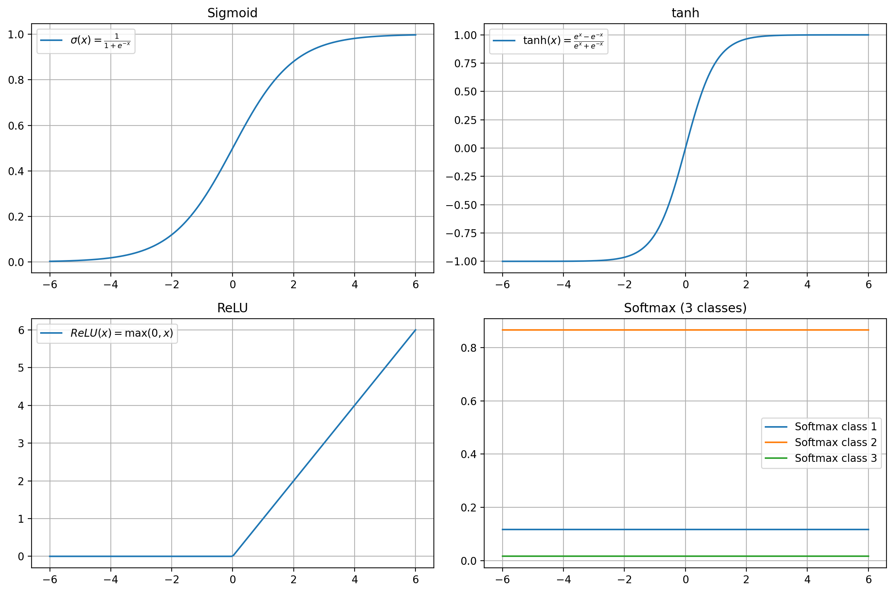

## 概要
活性化関数とは、ニューラルネットワークにおいて **非線形性を導入するための関数** です。  
これにより、<mark>**単純な線形モデルでは表現できない**</mark>複雑なパターンを学習できるようになります。  
例えば Sigmoid は (0~1)、tanh は (-1~1)、ReLU は (0~∞) の範囲で値を返し、関数ごとに出力範囲が異なります。

## 活性化関数がないとどうなる？

- ニューラルネットワークは**入力ベクトルに重みやベクトルを付けて足し合わせる**ことを層ごとに繰り返しています。
- もし活性化関数がなかったら、**どれだけ層を重ねても「ただの足し算と掛け算の組み合わせ」**にしかなりません。
- 数学的には「線形変換の合成」は、結局ひとつの線形変換と同じになるので、<mark>**1層の線形モデルと表現力が変わらない**</mark>のです。

👉 つまり、活性化関数がなければニューラルネットワークは「深い回路を作っても意味がない」状態になります。  
👉 活性化関数を入れることで、はじめて「曲線的な境界」や「複雑なパターン」を学習できるようになります。

## 関数の処理
活性化関数は、各ノードに入力される **重み付き和（線形結合）**  
$$
z_j = \sum_i w_{ij} x_i + b_j
$$
を受け取り、非線形に変換して出力します。  
この出力が次の層への入力値となります。

## メジャーな活性化関数

#### **Sigmoid（シグモイド）**
$$
\sigma(x)=\frac{1}{1+e^{-x}}
$$
- 🎯**出力範囲**: $0∼1$
- ✨**特徴**: 入力を滑らかに押しつぶし、確率のような解釈が可能。
- 👍**長所**: 2値分類などで確率的な出力を得たいときに便利。
- ⚠️**短所**: 大きな正負の値で勾配がほぼ0になりやすく、**勾配消失問題**を引き起こす。    
- 💡**用途**: 古典的なニューラルネットワークや出力層（2値分類）で使われる。
---
#### **tanh（タフ）**
$$
\mbox{tanh}(x)=\frac{e^{x}-e^{-x}}{e^{x}+e^{-x}}
$$
- 🎯**出力範囲**: $-1∼1$
- ✨**特徴**: Sigmoid と似ているが、出力が0中心になる。
- 👍**長所**: 平均が0付近に揃いやすく、学習が安定しやすい。
- ⚠️**短所**: Sigmoidと同様に大きな値で勾配消失が起きやすい。
- 💡**用途**: 隠れ層の活性化関数として使われる（特にRNNなどで昔よく利用された）。
---
#### **ReLU（Rectified Linear Unit）**
$$
\mbox{ReLU}(x)=\max(0,x)
$$
- 🎯**出力範囲**:$0∼\infty$
- ✨**特徴**: 負の入力は0、正の入力はそのまま出力。
- 👍**長所**: 計算が単純で高速、勾配消失が起きにくい。深層学習で主流。
- ⚠️**短所**: 負の値に対して勾配が0になるため、**ニューロンが死ぬ（dead neuron）問題**がある。
- 💡**用途**: CNNや多層パーセプトロンの隠れ層で最もよく使われる。
---
#### **Softmax**
$$
\mbox{Softmax}(z_{i})=\frac{e^{z_[i]}}{\sum_{j}e^{z_{j}}}
$$
- 🎯**出力範囲**: $0∼1$、かつ全体の和は1 
- ✨**特徴**: 入力ベクトル全体を確率分布に変換する。
- 👍**長所**: 多クラス分類において、各クラスの「確率」として解釈できる。
- ⚠️**短所**: 出力値がクラス数に依存し、外れ値や異常値に弱い。
- 💡**用途**: 多クラス分類の出力層（例：画像分類で犬・猫・鳥を分類）。
